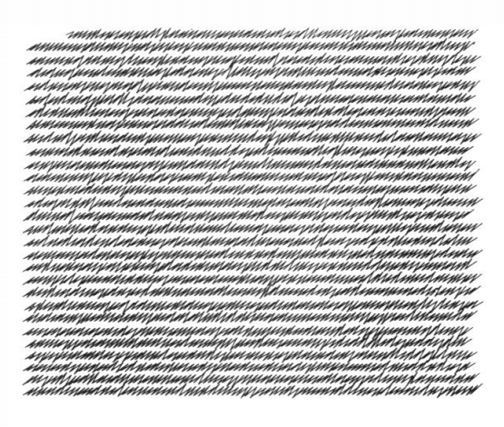
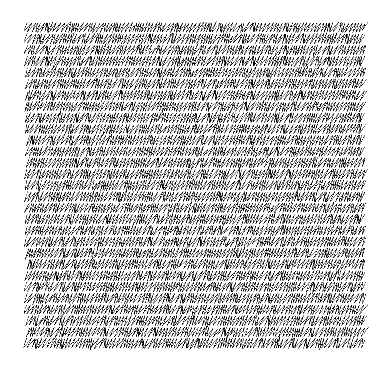
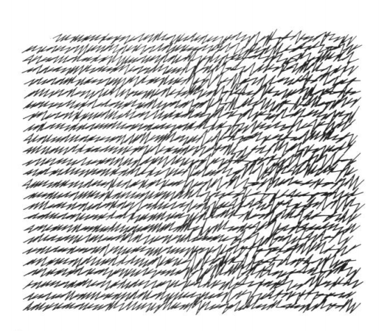
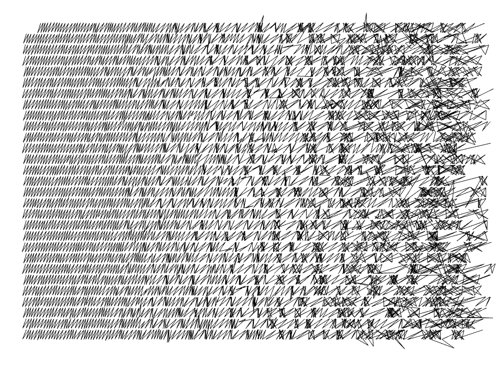
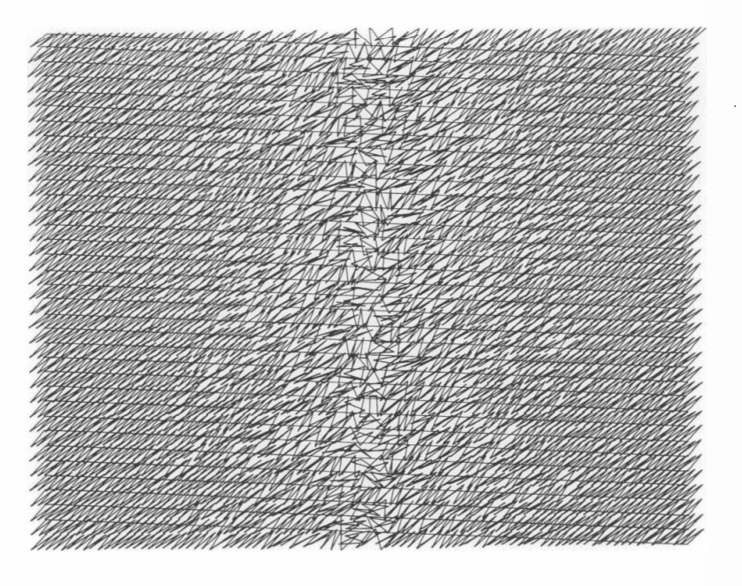
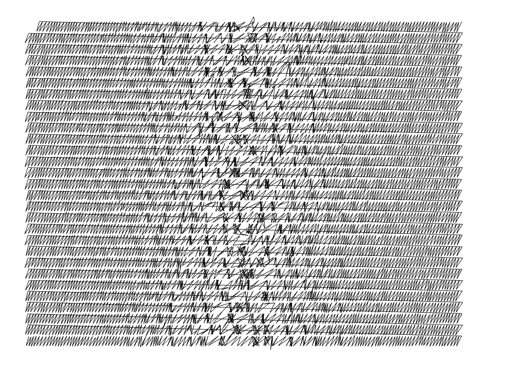

# Vera Molnár - My Mother’s Letters, 1984 & 1988

https://www.jstor.org/stable/1576070

Mother had a wonderful handwriting-somewhat Gothic,
somewhat hysterical. She began each line regularly and
strictly with Gothic letters, which toward the end of the line
became more and more restless, nervous, almost hysterical.
As she aged, the letters became quite troubled, perturbed.
Slowly the Gothic disappeared, leaving only the hysterical.
Each week I received a letter, which meant a real experience
for my visual world. The letters were more and more difficult
to decipher but they looked very pleasant.
After her death there were no more letters ...
I started "simulating" on computer her gothical-hysterical
missives to myself.

## Figure 1a

Original:

Recreation:

## Figure 1c

Original:

Recreation:

## Figure 4

Original:

Recreation:

## Post Scriptum II

Mother, darling, forgive me. You certainly would have said since you opposed me always (or perhaps I countered you?) that you have an even, orderly, clear writing. I sincerely ask of you not to be angry; I shall never again contradict you. And should I ever again simulate anybody's handwriting, it will be my own
